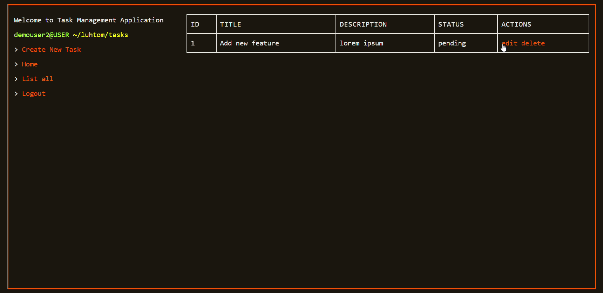

# Task Manager Web Application
## [日本語説明書](media/README_ja.md)

Task Manager web application that allow user to register/login and managing tasks.

### Feature
- User registration and authentication.
- Task create, read, update and delete.
- Task with status and user-specific data.

## Installation and running
```bash
git clone https://github.com/Larry-Tomson/spring-thym-task-manager-final-public
cd spring-thym-task-manager-final-public
```
Build
```bash 
mvn clean install
```

Run
```bash
mvn spring-boot:run
```
Application endpoint Default port : [localhost:8069](http://localhost:8069)
Edit endpoint[here](src\main\resources\application.properties)
## Requirement
- **Java Development Kit (JDK) 11 or later**  
  The project requires JDK 11 or above.  
  - [Download OpenJDK](https://jdk.java.net/)
  - [Oracle JDK](https://www.oracle.com/java/technologies/javase-jdk11-downloads.html).

- **Apache Maven 3.6.0 or later**  
  Maven is used to manage the project build lifecycle and dependencies.  
  [Maven Installation Guide](https://maven.apache.org/install.html)


## Stack
- Backend: Spring Boot
- Security: Spring Security
- Database: H2 embeded database
- Frontend: Thymeleaf template framework

## DEMO
### Login and Register

### List and Create Task

### Edit and Delete Task
