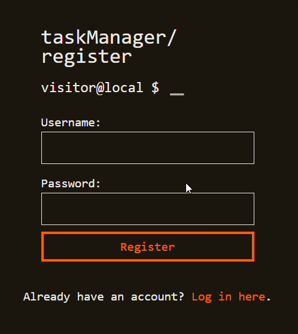
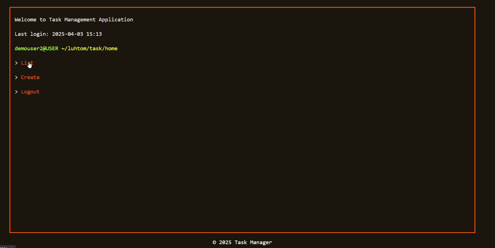

# タスクマネージャー・ウェブアプリケーション

ユーザー登録・ログインとタスク管理ウェブアプリケーション。

## インストールと実行方法
Clone
```bash
git clone https://github.com/Larry-Tomson/spring-thym-task-manager-final-public
cd spring-thym-task-manager-final-public
```

Build
```bash
mvn clean install
```

Run
```bash
mvn spring-boot:run
```

Application port: [localhost:8069](http://localhost:8069)
ポートの変更は[こちら](src\\main\\resources\\application.properties)

**Java Development Kit (JDK) 11以上**
[OpenJDKのダウンロード](https://jdk.java.net/) / [Oracle JDKのダウンロード](https://www.oracle.com/java/technologies/javase-jdk11-downloads.html)

**Apache Maven 3.6.0以上**  [Mavenのインストールガイド](https://maven.apache.org/install.html)

## 機能
  * ユーザー登録とログイン
  * タスクの作成、表示、更新、削除
  * タスクの状態管理とユーザーのタスク表示

## 使われている技術
  * Backend: Spring Boot
  * Security: Spring Security
  * Database: H2
  * Frontend: Thymeleaf Template Framework

## デモ
### 登録とログイン


### タスク表示と作成


### タスク更新と削除
